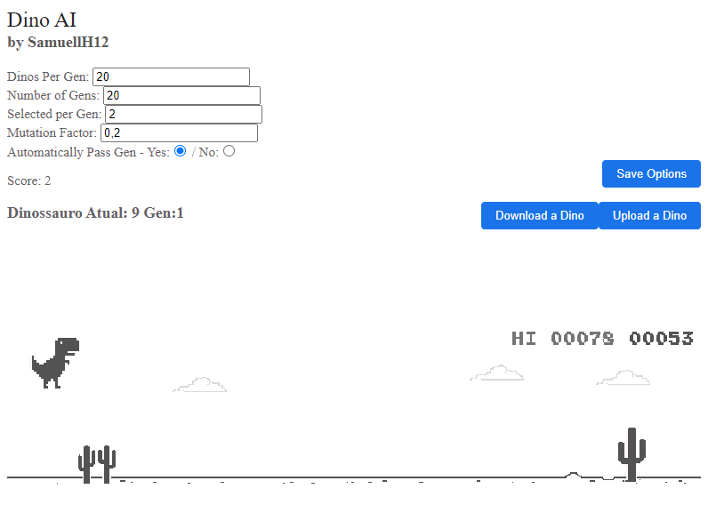
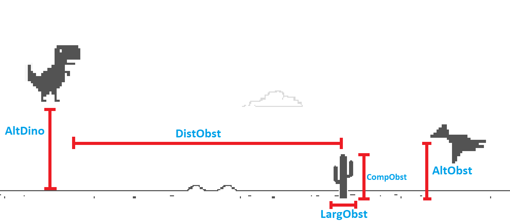

# Dino AI
Uma rede neural simples construída para jogar o famoso joguinho do Dinossauro do Chrome!

## Como a rede funciona? 🤔

A base é uma rede neural genérica, com: 
- **6 nós de entrada**;
- **6 nós ocultos** em apenas uma camada; e  
- **1 nó de saída**.

### Camada de Entrada
As 6 camadas da **entrada** recebem os seguintes valores:
- Altura do Dinossauro
- Distância do Obstáculo
- Altura do Obstáculo
- Largura do Obstáculo
- Comprimento do Obstáculo
- Velocidade do jogo

### Camada de Saída
A camada de saída contem apenas um neurônio, que pode representar três estados
dependendo do valor da saída:
- Jump/Pulo -> Quando a saída é maior que 0.55
- Duck/Abaixar -> Quando a saída é menor que 0.45
- Nada -> Não faz nada se o valor estiver entre esses dois

## O que é cada um desses arquivos? 🤔

### Meus códigos:
- **main.js**: Controla tudo quanto a execução do jogo, desde a Interface de Usuário à simulação de cada dinossauro individualmente.
- **dino.js**: É a classe do objeto Dino. Ele agrupa em si a Rede Neural do dinossauro, o brain, e a pontuação dele, além de fornecer alguns métodos importantes como o *mutar()* e o *hibrido(a, b)*.
- **RedeNeural.js**: É a classe que trás a Rede Neural e todos os seus métodos. É uma rede neural genérica, de apenas uma camada interna.
- **matrix.js**: uma classe que trás as funções de cálculos de uma matriz necessárias à rede neural.

### Códigos de outras pessoas/organizações:
- **index.html**: Esse é o jogo original do Dinossauro. A página foi baixada de: [chrome://dino](chrome://dino/) e quase não foi alterada, com exceção do import dos scripts utilizados e de uma div com o id "InfosAI".
- **duckJump.js**: É o código que simula as teclas sendo pressionadas. Esse código não é de minha autoria. Créditos: [Glauber Funez](https://gist.github.com/GlauberF/d8278ce3aa592389e6e3d4e758e6a0c2)
- **FileSaver.js**: Uso para facilitar o download do arquivo dos Dinos 😅. Créditos: [eligrey](https://github.com/eligrey/FileSaver.js/blob/master/dist/FileSaver.js)