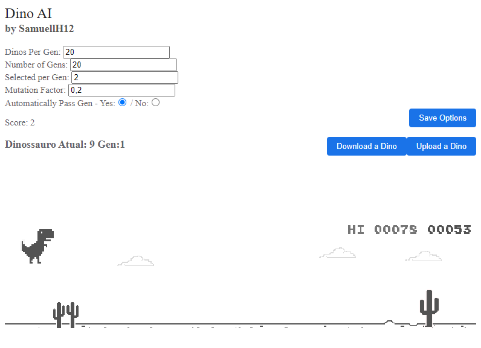

# Inteligências Artificiais para Jogos

Atualmente o único projeto aqui é o *Dino Chrome*.
Projetos na lista:
- Super Mario World
- StarCraft (Algum dia...)

# Dino AI
Uma rede neural simples construída para jogar o famoso joguinho do Dinossauro do Chrome!

## Como a rede funciona? 🤔

A base é uma rede neural genérica, com: 
- **6 nós de entrada**;
- **6 nós ocultos** em apenas uma camada; e  
- **1 nó de saída**.

### Camada de Entrada
As 6 camadas da **entrada** recebem os seguintes valores:
- Altura do Dinossauro
- Distância do Obstáculo
- Altura do Obstáculo
- Largura do Obstáculo
- Comprimento do Obstáculo
- Velocidade do jogo

### Camada de Saída
A camada de saída contem apenas um neurônio, que pode representar três estados
dependendo do valor da saída:
- Jump/Pulo -> Quando a saída é maior que 0.55
- Duck/Abaixar -> Quando a saída é menor que 0.45
- Nada -> Não faz nada se o valor estiver entre esses dois

